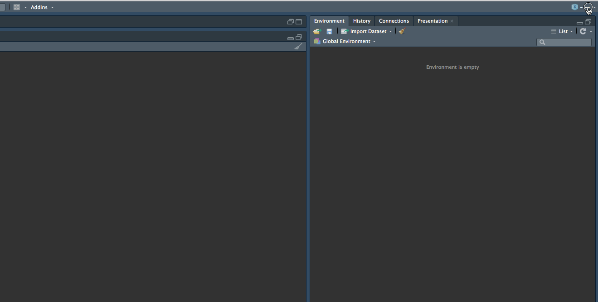
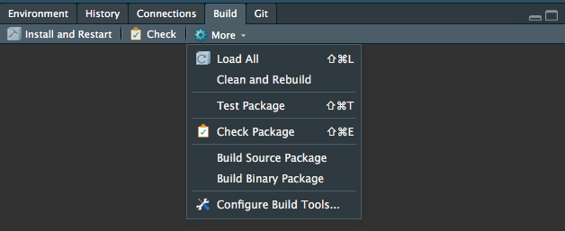
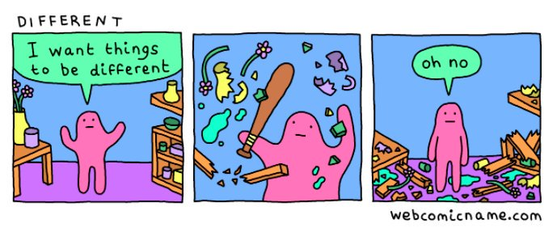

```{r setup, include=FALSE}
knitr::opts_chunk$set(echo = FALSE)
```

## Set Up This Presentation

```{bash echo=TRUE}
git clone https://github.com/scottmmjackson/webvrr
pushd webvrr
git checkout 22bed0102f2b23065d0a6896efd5dcd6af4f25ed
popd
```

_Always Make Your Research Reproducible_ -- Ancient R Proverb

## HTMLWidgets Package Layout

```{bash echo=TRUE}
tree -L 2 webvrr
```

## Making A New HTMLWidgets Project in RStudio



## What Now?

```{bash echo=TRUE}
tree myAwesomePackage
```

## What's Missing?

- `inst` - "installed files" (community convention)
- `javascript` - Excluded from the build process, for developer convenience
- `package.json`, `gulpfile.js` - For your Javascript build pipeline, if you want it

## The `inst/htmlwidgets` directory

```{bash echo=TRUE}
mkdir -p myAwesomePackage/inst/htmlwidgets
tree myAwesomePackage/inst
```

```{bash echo=TRUE}
tree -L 1 webvrr/inst/htmlwidgets
```

## More on `inst/htmlwidgets` directory

- `<widgetname>.js` 
  - javascript assets for your htmlwidget
  - filename (widgetname) should be the same as the name provided in the `htmlwidgets::createWidget` call
- `<widgetname>.yaml` 
  - declares the dependencies for your javascript assets
  
## `<widgetname>.yaml`

```{bash echo=TRUE}
cat webvrr/inst/htmlwidgets/webvrr.yaml
```

## How do you install javascript dependencies?

- Bower is appropriate here. 
- `npm install -g bower`

```{bash echo=TRUE}
cat webvrr/.bowerrc
```

## How does this get used in R?

```{bash echo=TRUE}
head -n 25 webvrr/R/webvrr.R  | tail -n 13
```

## Composing Functions

```{bash echo=TRUE}
head -n 104 webvrr/R/webvrr.R  | tail -n 10
```

- The `x` here is the same `x` argument to `createWidget`

## Composing Continued

```{bash echo=TRUE}
tail -n 20 webvrr/R/webvrr.R
```

## How about on the Javascript Side?

- I will show you how my actual Javascript looks later on.
- It's written in ES6 + Flow, which is why I have a full JS compilation pipeline in the package.
- For now, you'll get to see a much simpler example

## Ok, what's this fake example look like?

```javascript
// webvrr.js - not really though
HTMLWidgets.widget({
  name: 'webvrr',
  type: 'output',
  factory: function(el, width, height) {
    return {
      resize: function(newWidth, newHeight) {
        // do something here
        // no return value
      },
      renderValue: function(x) {
        // this is the same x we saw in createWidget
        // use `jsonlite::toJson` to see what it looks like
      },
      // more functions?
    }
  }
});
```

## Dependencies? 

- Recall: `<widgetname>.yaml`
- Dependencies are concatenated! (eww, globals)
- If you're like me and you use ES6+ modules, use this pattern (`leaflet` htmlwidgets use it too!)

```javascript
///// webvrr.js - the real one
///// SNIP
import THREE from './global/three';
///// SNIP

///// ./global/three.js
// @flow
export default global.THREE;

///// That's it. That's the whole file.
```

## Composing Functions: JS Part

```javascript
function doCall(c, scene) {
  switch (c.type) {
  // ... do some stuff to Scene
  }
}
// ...
// renderValue(x) {
// var calls = x.calls;
        (calls || []).forEach(c => doCall(c, scene));
// }
```

## Alright, I have a package, what now?

- Document all the things! http://r-pkgs.had.co.nz/man.html
- Write R tests: http://r-pkgs.had.co.nz/tests.html
- Write Javascript tests: https://mochajs.org/
- Make a README.md and check it in to github
  - Others can `devtools::install_github()` your package now!
- Build, check, and test your project
  - Run `roxygen::roxygenize(".")` frequently


## Check Results

The goal:
```
R CMD check results
0 errors | 0 warnings | 0 notes
```

... but we're likely to get a warning that our package is huge and it's all in our `inst/htmlwidgets` directory

## Oh no, my package is huge now



- Javascript dependencies are really bad about this.
```r
devtools::use_build_ignore(
  list.files(
    "inst/htmlwidgets/lib/", 
    recursive = TRUE, include.dirs = FALSE
  )
)
```

## Clean up

- Remove the files from `.RBuildIgnore` that you want to keep
- Hint: They're in your `<widgetname>.yaml` config

```{bash}
rm -rf webvrr
rm -rf myAwesomePackage/inst
```
