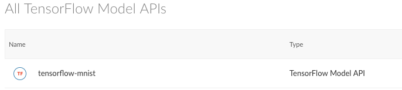

```{r setup, include=FALSE}
knitr::opts_chunk$set(echo = FALSE)
```

# Today's Meetup Brought To You By

## American Water

Attend the Innovation Revolution - Nov 16th

{width=100%}

# First Things

## Disclaimer

- This is a long presentation, but I can take questions during. Just raise your hand high.
- I'm speaking for myself this evening. All of my opinions are my own and do not necessarily reflect those of RStudio, Inc.

## Get The Things You Need

```{r, eval=F, echo=T}
devtools::install_github('rstudio/tensorflow')
devtools::install_github('rstudio/keras')
devtools::install_github('rstudio/tfdeploy')
devtools::install_github('rstudio/cloudml')
devtools::install_github('rstudio/rsconnect')
# Run Python inside R - surprisingly fast! 
# Also translates numpy dataframes to R dataframes on the fly 😮
devtools::install_github('rstudio/reticulate') 
```

## GPU Acceleration

- nVidia GPU
- Proprietary drivers
- CUDA Toolkit 9.0
- cuDNN SDK 7.2+

https://www.tensorflow.org/install/gpu

## More on GPU Acceleration

- Multiple GPUs are supported
- Amazon EC2 P3
- Google Cloud Compute GPU
- Microsoft Azure NC Series

## Hosting Side Note

- Google Cloud ML: https://cloud.google.com/ml-engine/
- RStudio Connect



## My tools

- RStudio (Sorry, shameless plug, I know.)
    - You'll want the latest versions for Jobs support!
    - Comes in Desktop & Server, FOSS and Pro flavors

# Tensorflow Library

## What can you do with TensorFlow?

```{r, echo=TRUE}
library(tensorflow)
tensorflow::tf_version()
```

## Use MNIST Data

```{r, echo = T}
sess <- tf$Session()
data <- tf$
  contrib$
  learn$
  datasets$
  mnist$
  read_data_sets('MNIST', one_hot = T)
len <- length(data$test$images[1,])[[1]]
len
```

## and...

```{r, echo=T}
input <- tf$placeholder(
  dtype = tf$float32,
  shape = shape(NULL, len)
  )
# y = WX + b
W <- tf$Variable(tf$zeros(shape(len, 10)))
B <- tf$Variable(tf$zeros(shape(10)))
Y <- tf$nn$softmax(tf$matmul(input, W) + B)
```

## and...

```{r, echo=T}
# Output
Y_ <- tf$placeholder(tf$float32, shape(NULL, 10L))

# Cross-entropy loss function
cross_entropy <- tf$reduce_mean(-tf$reduce_sum(Y_ * tf$log(Y), reduction_indices=1L))

train_step <- tf$train$GradientDescentOptimizer(0.5)$minimize(cross_entropy)

sess$run(tf$global_variables_initializer())
```

## Training

```{r, echo=T}
for (i in 1:2000) {
  batches <- data$train$next_batch(100L)
  batch_xs <- batches[[1]]
  batch_ys <- batches[[2]]
  sess$run(train_step,
           feed_dict = dict(input = batch_xs, Y_ = batch_ys))
}
```

## Accuracy

```{r, echo=T}
correct_prediction <- tf$equal(tf$argmax(Y, 1L), tf$argmax(Y_, 1L))
accuracy <- tf$reduce_mean(tf$cast(correct_prediction, tf$float32))

sess$run(accuracy, feed_dict=dict(input = data$test$images, Y_ = data$test$labels))
```

# Keras Library

## Basic Import

```{r, echo=T}
library(keras)
keras::is_keras_available()
```

## Same Idea

```{r, echo=T}
library(zeallot)

# load data
c(c(x_train, y_train), c(x_test, y_test)) %<-% dataset_mnist()
# reshape and rescale
x_train <- array_reshape(x_train, dim = c(nrow(x_train), 784)) / 255
x_test <- array_reshape(x_test, dim = c(nrow(x_test), 784)) / 255
# one-hot encode response
y_train <- to_categorical(y_train, 10)
y_test <- to_categorical(y_test, 10)
```

## Model is a bit more declarative

```{r, echo=T}
# define and compile model
model <- keras_model_sequential()
model %>%
  layer_dense(units = 32, activation = 'relu', input_shape = c(784),
              name = "image") %>%
  layer_dense(units = 16, activation = 'relu') %>%
  layer_dense(units = 10, activation = 'softmax',
              name = "prediction") %>%
  compile(
    loss = 'categorical_crossentropy',
    optimizer = optimizer_rmsprop(),
    metrics = c('accuracy')
  )
```

## Training

```{r, echo=T}
# train model
history <- model %>% fit(
  x_train, y_train,
  epochs = 30, batch_size = 128,
  validation_split = 0.2
)
```

# RStudio Jobs

## Step 1: Get a Script

[How About That TensorFlow MNIST Script?](https://github.com/rstudio/tfdeploy/blob/master/inst/models/keras-mnist.R)

## Step 2: Execute that Job

<video autoplay><source src="rstudio-jobs.webm"></video>

## Why do I want this?

- Actually decent models require tons of data and lots of training time
- Queue a job on a server and go do more important things
- Do more than one at once

# Data Sources

## What kind of data do I want?

- Predictable/Classifiable data
- LOTS: Deep learning in particular needs a high N
- Normalized? Not necessarily- deep learning techniques are resilient to poor normalization, provided you have _enough_.

## Where?

- https://www.kaggle.com/datasets
- https://www.opendataphilly.org/
- https://www.data.gov/

# Saved Models

## Tensorflow

```{r, echo=T, eval=F}
export_savedmodel(
  sess,
  "tensorflow-mnist",
  inputs = list(images = input),
  outputs = list(scores = Y))
```

## Keras

```{r, echo = T, eval = F}
export_savedmodel(model, "keras-mnist")
```

## TFDeploy

```{r, echo=T, eval=F}
library(tfdeploy)
serve_savedmodel('tensorflow-mnist', browse=T)
```

## CloudML

```{r, echo =T, eval=F}
library(cloudml)
cloudml_deploy('tensorflow-mnist', name='tensorflow_mnist', version='tensorflow_mnist_1')
```

## RStudio Connect

```{r, echo=T, eval=F}
library(rsconnect)
deployTFModel('tensorflow-mnist', account = 'me', server = 'example.com')
```

## RStudio Connect Tensorflow Demo

Enjoy the show

## Mobile devices

https://www.tensorflow.org/lite/

1. Convert your saved model using https://www.tensorflow.org/lite/convert/
1. Include in mobile projects
1. ???
1. Profit! (No, really...)

## Web Browsers

- Yes, really.
- https://js.tensorflow.org/
- Surprisingly high performance