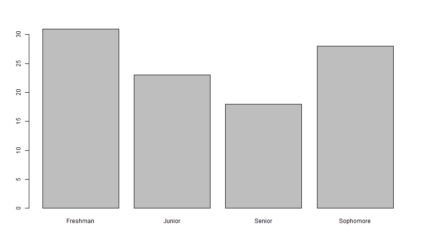
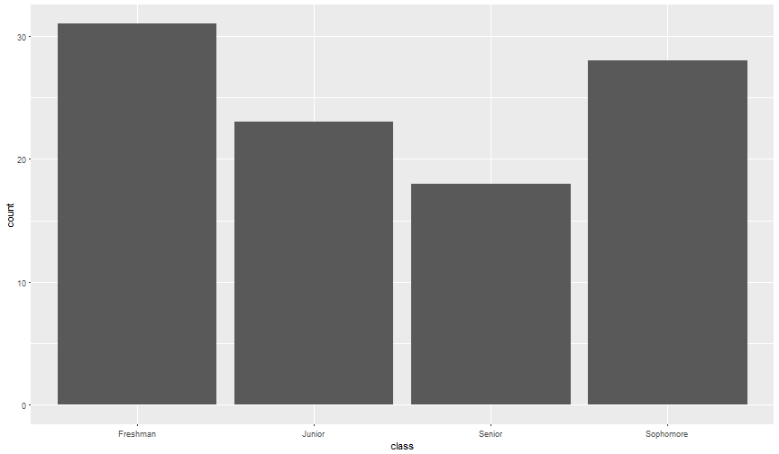
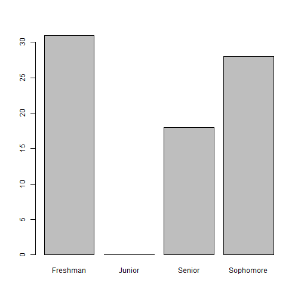
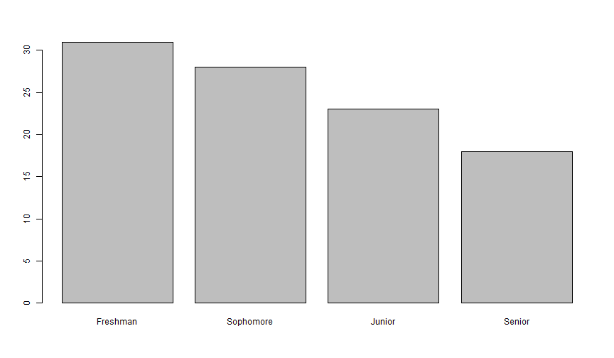
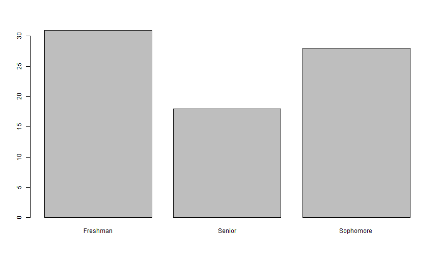
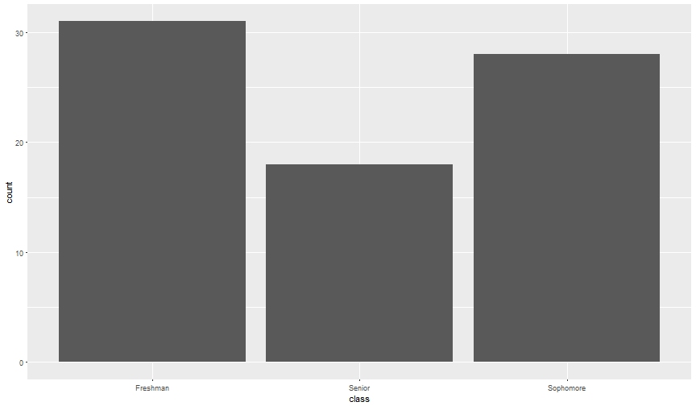
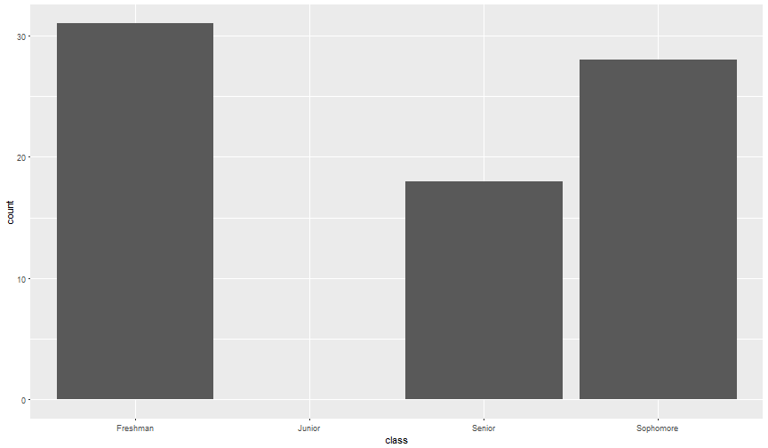

PhillyR Learn R Series: Fun with Factors
========================================================
author: Leon Kim
date: December 6, 2017
incremental: false
width: 1980
height: 980


Factors
========================================================
- Factor variable is a variable that takes some limited number of different values.

- In real life, this is what categorical variable is

- These limited values can be boolean, numeric, or text

-- `IsFraud` : fraud or not fraud (true or not true)

-- `GradeLevel` : 1, 2, 3, 4, ..., 12

-- `Treatment` : "control", "treatment A", or "treatment B"

The real life 
========================================================
- Categorical variables are in raw format


```
# A tibble: 6 x 6
  gender      major     class   gpa   sat drops
   <chr>      <chr>     <chr> <dbl> <int> <int>
1 Female    Physics Sophomore   3.1  1230     0
2 Female    Biology Sophomore   1.9   870     1
3   Male Psychology    Senior   3.2  1180     4
4 Female Psychology Sophomore   2.6  1190     2
5 Female      Music    Senior   2.8   770     4
6   Male    English  Freshman   2.1   850     0
```

- Categorical variables can be coded

```
# A tibble: 6 x 7
  gender      major     class   gpa   sat drops  Male
   <chr>      <chr>     <chr> <dbl> <int> <int> <dbl>
1 Female    Physics Sophomore   3.1  1230     0     0
2 Female    Biology Sophomore   1.9   870     1     0
3   Male Psychology    Senior   3.2  1180     4     1
4 Female Psychology Sophomore   2.6  1190     2     0
5 Female      Music    Senior   2.8   770     4     0
6   Male    English  Freshman   2.1   850     0     1
```

Categorical variable with multiple values
========================================================

```r
sort(unique(Undergrad$major)) # Undergrad from library(BSDA)
```

```
 [1] "Accounting" "Biology"    "Chemistry"  "English"    "Geology"   
 [6] "History"    "Math"       "Music"      "Physics"    "Psychology"
[11] "Sociology" 
```
- What if we make "Accounting" -> 1, "Biology" -> 2, ... , "Sociology" -> 11


```
# A tibble: 6 x 7
  gender      major     class   gpa   sat drops major_coded
   <chr>      <chr>     <chr> <dbl> <int> <int>       <dbl>
1 Female    Physics Sophomore   3.1  1230     0           9
2 Female    Biology Sophomore   1.9   870     1           2
3   Male Psychology    Senior   3.2  1180     4          10
4 Female Psychology Sophomore   2.6  1190     2          10
5 Female      Music    Senior   2.8   770     4           8
6   Male    English  Freshman   2.1   850     0           4
```

Why numbers to represent characters?
========================================================
- R and it's predecessor S were primarily used for statistical purposes.

- Character variable usually represented some measurement with limited possible values.

- To use character variable in statistical models, it needs to be expanded to dummy variables (more on this later).

RAM is expensive
========================================================
- When you know **major** values takes one of 11 character string, why bother storing duplicate values? (similar to relational databases and duplicate values)

- In computers, characters take more *bits* to represent than integers do

- Key concepts for factor variable implementation:

> 1. Use numbers to represent each unique characters

> 2. Factor variable should store this meta data (string <-> number mapping)

major as a factor variable
========================================================

```r
major_f <- factor(Undergrad$major); head(major_f)
```

```
[1] Physics    Biology    Psychology Psychology Music      English   
11 Levels: Accounting Biology Chemistry English Geology History ... Sociology
```

```r
# Character variable
class(Undergrad$major)
```

```
[1] "character"
```

```r
# Factor variable
class(major_f)
```

```
[1] "factor"
```

```r
# See all the possible values for major variable
levels(major_f)
```

```
 [1] "Accounting" "Biology"    "Chemistry"  "English"    "Geology"   
 [6] "History"    "Math"       "Music"      "Physics"    "Psychology"
[11] "Sociology" 
```

Surprise
========================================================

```r
# ????
typeof(major_f)
```

```
[1] "integer"
```

```r
# what happens if we try to convert to numeric?
as.numeric(major_f)[1:10]
```

```
 [1]  9  2 10 10  8  4  9  6  5  4
```

```r
as.numeric(Undergrad$major)[1:10]
```

```
 [1] NA NA NA NA NA NA NA NA NA NA
```

```r
# See the structure using str()
str(major_f)
```

```
 Factor w/ 11 levels "Accounting","Biology",..: 9 2 10 10 8 4 9 6 5 4 ...
```

R object attributes
========================================================
- R objects can have attributes (metadata) about the object
- An attribute can be added by name to any R object


```r
head(mtcars) 
```

```
                   mpg cyl disp  hp drat    wt  qsec vs am gear carb
Mazda RX4         21.0   6  160 110 3.90 2.620 16.46  0  1    4    4
Mazda RX4 Wag     21.0   6  160 110 3.90 2.875 17.02  0  1    4    4
Datsun 710        22.8   4  108  93 3.85 2.320 18.61  1  1    4    1
Hornet 4 Drive    21.4   6  258 110 3.08 3.215 19.44  1  0    3    1
Hornet Sportabout 18.7   8  360 175 3.15 3.440 17.02  0  0    3    2
Valiant           18.1   6  225 105 2.76 3.460 20.22  1  0    3    1
```

```r
names(mtcars)
```

```
 [1] "mpg"  "cyl"  "disp" "hp"   "drat" "wt"   "qsec" "vs"   "am"   "gear"
[11] "carb"
```

```r
rownames(mtcars)
```

```
[1] "Mazda RX4"         "Mazda RX4 Wag"     "Datsun 710"       
[4] "Hornet 4 Drive"    "Hornet Sportabout" "Valiant"          
```

R object attributes
========================================================

```r
attributes(mtcars)
```

```
$names
 [1] "mpg"  "cyl"  "disp" "hp"   "drat" "wt"   "qsec" "vs"   "am"   "gear"
[11] "carb"

$row.names
[1] "Mazda RX4"         "Mazda RX4 Wag"     "Datsun 710"       
[4] "Hornet 4 Drive"    "Hornet Sportabout" "Valiant"          

$class
[1] "data.frame"
```
***

```r
attr(mtcars, "my_attribute") <- "I love R"
attributes(mtcars)
```

```
$names
 [1] "mpg"  "cyl"  "disp" "hp"   "drat" "wt"   "qsec" "vs"   "am"   "gear"
[11] "carb"

$row.names
[1] "Mazda RX4"         "Mazda RX4 Wag"     "Datsun 710"       
[4] "Hornet 4 Drive"    "Hornet Sportabout" "Valiant"          

$class
[1] "data.frame"

$my_attribute
[1] "I love R"
```

Get & set attributes using functions
========================================================
- **levels**: "levels provides access to the levels attribute of a variable. The first form returns the value of the levels of its argument and the second sets the attribute."


```r
iris$Species[c(1, 60, 120)]
```

```
[1] setosa     versicolor virginica 
Levels: setosa versicolor virginica
```

```r
iris$Species_new <- iris$Species; levels(iris$Species_new)
```

```
[1] "setosa"     "versicolor" "virginica" 
```
***

```r
levels(iris$Species_new) <- c("SETOSA", "VERSICOLOR", "VIRGINICA")
levels(iris$Species_new)
```

```
[1] "SETOSA"     "VERSICOLOR" "VIRGINICA" 
```

```r
head(iris[c(1, 60, 120),c("Species", "Species_new")])
```

```
       Species Species_new
1       setosa      SETOSA
60  versicolor  VERSICOLOR
120  virginica   VIRGINICA
```

Get & set attributes using attr()
========================================================
- When no functions are available (or you are making your own custom attributes), use **attr(object, attribute_name)**


```r
attributes(iris$Species) # List all attributes in R object
```

```
$levels
[1] "setosa"     "versicolor" "virginica" 

$class
[1] "factor"
```

```r
attr(iris$Species, "levels") # Get
```

```
[1] "setosa"     "versicolor" "virginica" 
```

```r
attr(iris$Species, "levels") <- c("SETOSA", "VERSICOLOR", "VIRGINICA") # Set
attr(iris$Species, "levels")
```

```
[1] "SETOSA"     "VERSICOLOR" "VIRGINICA" 
```

- Sneak peak: factor levels should not be modified this way, but the above shows how to modify attributes in general.

Back to factors
========================================================
- By understanding how attributes work, we can see that a vector of characters are changed to numeric variables 

- 1 corresponds to 1st level, 2 corresponds to 2nd level etc. and are indexed to the levels. Default behavior of **factors** is to sort levels alphabetically.

- On the R console, you don't see these indices and only see the character levels corresponding to the indices. However, factor variables act like they are indices.

- numeric variables can be factor variables as well-- but levels are stored as characters

What does this mean for my daily R use?
========================================================
- Factor variables look like character variables and even allows some functions to implicitly work (e.g. **paste()**)

- Many "gotchas" when your categorical variables are numbers


```r
df <- data.frame(
  name = c("Scott", "Leon", "Jeremy", "Hadley"),
  grade = factor(c(2, 1, 5, 5))
)
df
```

```
    name grade
1  Scott     2
2   Leon     1
3 Jeremy     5
4 Hadley     5
```

```r
df$grade
```

```
[1] 2 1 5 5
Levels: 1 2 5
```


```r
mean(df$grade) # Can't add factors, will result in error
```


What is the average grade of R Users?
========================================================

```r
df$grade
```

```
[1] 2 1 5 5
Levels: 1 2 5
```

```r
grade_as_numeric <- as.numeric(df$grade)
mean(grade_as_numeric)
```

```
[1] 2.25
```

```r
# Expected something else
mean(c(2,1,5,5))
```

```
[1] 3.25
```

```r
grade_as_numeric # Let's take a look. Something's wrong. Where did 3 come from?
```

```
[1] 2 1 3 3
```

```r
levels(df$grade) # Reason: look at the 3rd level
```

```
[1] "1" "2" "5"
```

To get the factor levels values, use indexing technique
========================================================

```r
levels(df$grade) # the target
```

```
[1] "1" "2" "5"
```

```r
df$grade # the indices! Remember how factor is numeric index of levels?
```

```
[1] 2 1 5 5
Levels: 1 2 5
```

```r
levels(df$grade)[df$grade]
```

```
[1] "2" "1" "5" "5"
```

```r
as.numeric(levels(df$grade)[df$grade])
```

```
[1] 2 1 5 5
```

```r
mean(as.numeric(levels(df$grade)[df$grade]))
```

```
[1] 3.25
```

Factor use cases in data visualization
========================================================

```r
Undergrad$class <- factor(Undergrad$class) # make to factor
levels(Undergrad$class)
```

```
[1] "Freshman"  "Junior"    "Senior"    "Sophomore"
```

```r
barplot(table(Undergrad$class))
```



***


```r
ggplot(Undergrad, aes(class)) + geom_bar()
```




What happens if we subset the data
========================================================
- When subsetted, the factor variable keeps the levels even if it doesn't exist


```r
Undergrad_no_junior <- subset(Undergrad, class != "Junior")
table(Undergrad_no_junior$class)
```

```

 Freshman    Junior    Senior Sophomore 
       31         0        18        28 
```

```r
levels(Undergrad_no_junior$class)
```

```
[1] "Freshman"  "Junior"    "Senior"    "Sophomore"
```

```r
unique(as.numeric(Undergrad_no_junior$class)) # look at unique indices
```

```
[1] 4 3 1
```
***

```r
barplot(table(Undergrad_no_junior$class))
```



- **levels** attributes isn't just some useless metadata.

Re-ordering the categorical groups in plot
========================================================
- Possibly the most asked questions on Stackoverflow
- Just re-order the **levels** by factoring the variable with different levels specified


```r
Undergrad$class_refactored <- 
  factor(Undergrad$class, levels = c("Freshman", "Sophomore", "Junior", "Senior"))
head(Undergrad[,c("class", "class_refactored")])
```

```
# A tibble: 6 x 2
      class class_refactored
     <fctr>           <fctr>
1 Sophomore        Sophomore
2 Sophomore        Sophomore
3    Senior           Senior
4 Sophomore        Sophomore
5    Senior           Senior
6  Freshman         Freshman
```
***

```r
levels(Undergrad$class_refactored)
```

```
[1] "Freshman"  "Sophomore" "Junior"    "Senior"   
```

```r
barplot(table(Undergrad$class_refactored))
```



Do not assign to level directly
========================================================
- **level(x) <- c(...)** only changes the unique levels, not the indicies. The internal values will be messed up (wrong index maps to wrong level)


```r
Undergrad$class_via_levels_assign <- Undergrad$class
Undergrad$class_via_attr <- Undergrad$class
# Two wrong ways to re-order factors
levels(Undergrad$class_via_levels_assign) <- c("Freshman", "Sophomore", "Junior", "Senior")
attr(Undergrad$class_via_attr, "levels") <- c("Freshman", "Sophomore", "Junior", "Senior")
# Let's see if the value orders stayed the same
head(Undergrad[,c("class", "class_refactored", "class_via_levels_assign","class_via_attr")])
```

```
# A tibble: 6 x 4
      class class_refactored class_via_levels_assign class_via_attr
     <fctr>           <fctr>                  <fctr>         <fctr>
1 Sophomore        Sophomore                  Senior         Senior
2 Sophomore        Sophomore                  Senior         Senior
3    Senior           Senior                  Junior         Junior
4 Sophomore        Sophomore                  Senior         Senior
5    Senior           Senior                  Junior         Junior
6  Freshman         Freshman                Freshman       Freshman
```

- Use **level(x) <- c(...)** to replace the value of levels. **level(x) <- c(...)** is the preferred method than **attr(x, "levels") <- c(...)**

Other helpful functions to change levels
========================================================
- **factor(x, ...)**: various parameters available in factor function

- **relevel**: sets one of the factor level as the first level, moving the rest of the levels down 

- **reorder(x, y, FUN)**: for each subset of rows with value x, determine the factor order of x by FUN(y)

- **levels(x)[i] <- NA**: removes the i^th level from factor variable. Any value with that level will be NA

- **x[, drop = TRUE]** removes all levels without any matching indices


```r
levels(Undergrad_no_junior$class)[2] <- NA
barplot(table(Undergrad_no_junior$class))
```
***
- Probably the second most popular question in Stackoverflow: "How to remove a empty group from plot"



Except for ggplot2
========================================================
- **ggplot** plots are generous enough to remove factor level with no values from plotting


```r
ggplot(Undergrad_no_junior, aes(class)) + 
  geom_bar()
```


***
- Use **scale_*_discrete(drop=FALSE)** to force all factor levels to show up

```r
ggplot(Undergrad_no_junior, aes(x=class)) + 
  geom_bar() + 
  scale_x_discrete(drop=FALSE)
```



Factors in visualizations
========================================================
- the order of the levels matter

- the possible choices of levels matter

- base plot vs ggplot behavior

Factor math
========================================================
- In **factor()** there is a parameter **ordered**. There is also a function called **ordered()**


```r
head(Undergrad$class_refactored)
```

```
[1] Sophomore Sophomore Senior    Sophomore Senior    Freshman 
Levels: Freshman Sophomore Junior Senior
```

```r
head(Undergrad$class_ordered <- factor(Undergrad$class_refactored, ordered=T))
```

```
[1] Sophomore Sophomore Senior    Sophomore Senior    Freshman 
Levels: Freshman < Sophomore < Junior < Senior
```

- The "order" of levels in previous slides are not actually "in order". The levels attribute for the factor variable just happened to be in the order that we want.

- If there is a legitimate order to the factor levels and you want to do some mathematical operations with respects to that order, make your factor an ordered one.


```r
Undergrad$class_ordered[2] < Undergrad$class_ordered[3] # Sophomore vs Senior
```

```
[1] TRUE
```


```r
Undergrad$class[2] < Undergrad$class[3] # returns NA with warning
```

Factors in regression
========================================================
- Many statistical models require numeric variables for the model training step (e.g. regression)

- In Python model fitting process, preprocessing steps involve converting categorical variable to numeric columns.

- In R, this step is essentially done automatically / hidden away from you because of factor variables (for better or worse)

- You probably know this step as creating dummy variables, contrast treatment, or one-hot encoding


```r
contrasts(Undergrad$class) 
```

```
          Junior Senior Sophomore
Freshman       0      0         0
Junior         1      0         0
Senior         0      1         0
Sophomore      0      0         1
```

```r
head(stats::model.matrix(~class, Undergrad))
```

```
  (Intercept) classJunior classSenior classSophomore
1           1           0           0              1
2           1           0           0              1
3           1           0           1              0
4           1           0           0              1
5           1           0           1              0
6           1           0           0              0
```


Running regression models
========================================================
- Fortunately for us, we don't need to do manually create dummy variables like this. R does this for us, but we should know what's happening

- We should note that the default behavior is to treat the first factor level as the reference group

- If you did not explicitly create factor variable, R will convert the character variable with the the *smallest* factor level as the reference group

- *smallest*? : smallest in terms of alphanumeric order -- i.e. the default behavior of factor we talked about earlier 


Regression example with hand-waving explanations
========================================================
- One level has to be dropped because we know the last category if we know all the others (i.e. first factor level if we are using the default R behavior)

- Intercepts

- Other encoding techniques exist, including those for ordered factors

- See more more talented people explain this very important but often ignored topic:

1. https://stats.idre.ucla.edu/r/library/r-library-contrast-coding-systems-for-categorical-variables/
2. http://appliedpredictivemodeling.com/blog/2013/10/23/the-basics-of-encoding-categorical-data-for-predictive-models
3. http://www.win-vector.com/blog/2017/04/encoding-categorical-variables-one-hot-and-beyond/


In action: Let's model a student's  number of courses dropped
========================================================


```r
head(Undergrad)
```

```
# A tibble: 6 x 6
  gender      major     class   gpa   sat drops
   <chr>      <chr>    <fctr> <dbl> <int> <int>
1 Female    Physics Sophomore   3.1  1230     0
2 Female    Biology Sophomore   1.9   870     1
3   Male Psychology    Senior   3.2  1180     4
4 Female Psychology Sophomore   2.6  1190     2
5 Female      Music    Senior   2.8   770     4
6   Male    English  Freshman   2.1   850     0
```

```r
# Evaluate the effect of class on number of course drops
broom::tidy(lm(drops ~ class + gpa + gender, data = Undergrad))
```

```
            term   estimate std.error  statistic      p.value
1    (Intercept)  2.3713166 0.5913486  4.0100146 1.393797e-04
2 classSophomore  0.9177668 0.3173665  2.8918202 4.976428e-03
3    classJunior  1.7119629 0.3287196  5.2079733 1.546341e-06
4    classSenior  2.0758577 0.3483311  5.9594385 7.157770e-08
5            gpa -0.6130617 0.1938350 -3.1628023 2.236440e-03
6     genderMale -0.2049396 0.2178306 -0.9408208 3.497389e-01
```

Reference group
========================================================

```r
head(Undergrad$class_Sen <- relevel(Undergrad$class, "Senior"))
```

```
[1] Sophomore Sophomore Senior    Sophomore Senior    Freshman 
Levels: Senior Freshman Sophomore Junior
```

```r
# Evaluate the effect of class on number of course drops
broom::tidy(lm(drops ~ class_Sen + gpa + gender, data = Undergrad))
```

```
                term   estimate std.error  statistic      p.value
1        (Intercept)  4.4471742 0.5906447  7.5293559 8.153323e-11
2  class_SenFreshman -2.0758577 0.3483311 -5.9594385 7.157770e-08
3 class_SenSophomore -1.1580908 0.2981021 -3.8848801 2.151357e-04
4    class_SenJunior -0.3638948 0.3057749 -1.1900739 2.376737e-01
5                gpa -0.6130617 0.1938350 -3.1628023 2.236440e-03
6         genderMale -0.2049396 0.2178306 -0.9408208 3.497389e-01
```


Side-by-side
========================================================

```r
m_fresh <- broom::tidy(lm(drops ~ class + gpa + gender, data = Undergrad))[,c(1:3,5)]
m_fresh$p.value <- round(m_fresh$p.value, 4)
m_fresh
```

```
            term   estimate std.error p.value
1    (Intercept)  2.3713166 0.5913486  0.0001
2 classSophomore  0.9177668 0.3173665  0.0050
3    classJunior  1.7119629 0.3287196  0.0000
4    classSenior  2.0758577 0.3483311  0.0000
5            gpa -0.6130617 0.1938350  0.0022
6     genderMale -0.2049396 0.2178306  0.3497
```

```r
# E(drops) of a junior male with GPA of 3.0
(2.3713166) + (1.7119629) + (-0.6130617*3.0) + (-0.2049396)
```

```
[1] 2.039155
```
***

```r
m_senior <- broom::tidy(lm(drops ~ class_Sen + gpa + gender, data = Undergrad))[,c(1:3,5)]
m_senior$p.value <- round(m_senior$p.value, 4)
m_senior
```

```
                term   estimate std.error p.value
1        (Intercept)  4.4471742 0.5906447  0.0000
2  class_SenFreshman -2.0758577 0.3483311  0.0000
3 class_SenSophomore -1.1580908 0.2981021  0.0002
4    class_SenJunior -0.3638948 0.3057749  0.2377
5                gpa -0.6130617 0.1938350  0.0022
6         genderMale -0.2049396 0.2178306  0.3497
```

```r
# E(drops) of a junior male with GPA of 3.0
(4.4471742) + (-0.3638948) + (-0.6130617*3.0) + (-0.2049396)
```

```
[1] 2.039155
```


The magic trick
========================================================

```r
table(Undergrad$class)
```

```

 Freshman Sophomore    Junior    Senior 
       14        28        23        18 
```

```r
head(Undergrad$class_Soph <- relevel(Undergrad$class, "Sophomore"))
```

```
[1] Sophomore Sophomore Senior    Sophomore Senior    Freshman 
Levels: Sophomore Freshman Junior Senior
```

```r
m_soph <- broom::tidy(lm(drops ~ class_Soph + gpa + gender, data = Undergrad))[,c(1:3,5)]
m_soph$p.value <- round(m_soph$p.value, 4)

head(Undergrad$class_Jun <- relevel(Undergrad$class, "Junior"))
```

```
[1] Sophomore Sophomore Senior    Sophomore Senior    Freshman 
Levels: Junior Freshman Sophomore Senior
```

```r
m_junior <- broom::tidy(lm(drops ~ class_Jun + gpa + gender, data = Undergrad))[,c(1:3,5)]
m_junior$p.value <- round(m_junior$p.value, 4)
```

Lies, damn lies, and statistics
========================================================

```r
m_fresh
```

```
            term   estimate std.error p.value
1    (Intercept)  2.3713166 0.5913486  0.0001
2 classSophomore  0.9177668 0.3173665  0.0050
3    classJunior  1.7119629 0.3287196  0.0000
4    classSenior  2.0758577 0.3483311  0.0000
5            gpa -0.6130617 0.1938350  0.0022
6     genderMale -0.2049396 0.2178306  0.3497
```

```r
m_soph
```

```
                term   estimate std.error p.value
1        (Intercept)  3.2890834 0.5911226  0.0000
2 class_SophFreshman -0.9177668 0.3173665  0.0050
3   class_SophJunior  0.7941961 0.2771953  0.0054
4   class_SophSenior  1.1580908 0.2981021  0.0002
5                gpa -0.6130617 0.1938350  0.0022
6         genderMale -0.2049396 0.2178306  0.3497
```
***

```r
m_junior
```

```
                term   estimate std.error p.value
1        (Intercept)  4.0832795 0.5563074  0.0000
2  class_JunFreshman -1.7119629 0.3287196  0.0000
3 class_JunSophomore -0.7941961 0.2771953  0.0054
4    class_JunSenior  0.3638948 0.3057749  0.2377
5                gpa -0.6130617 0.1938350  0.0022
6         genderMale -0.2049396 0.2178306  0.3497
```

```r
m_senior
```

```
                term   estimate std.error p.value
1        (Intercept)  4.4471742 0.5906447  0.0000
2  class_SenFreshman -2.0758577 0.3483311  0.0000
3 class_SenSophomore -1.1580908 0.2981021  0.0002
4    class_SenJunior -0.3638948 0.3057749  0.2377
5                gpa -0.6130617 0.1938350  0.0022
6         genderMale -0.2049396 0.2178306  0.3497
```

Tips for using factors in modeling (with neither guarantee nor justification)
========================================================
- Use the most frequent level as the reference group

- Use other encoding techniques
